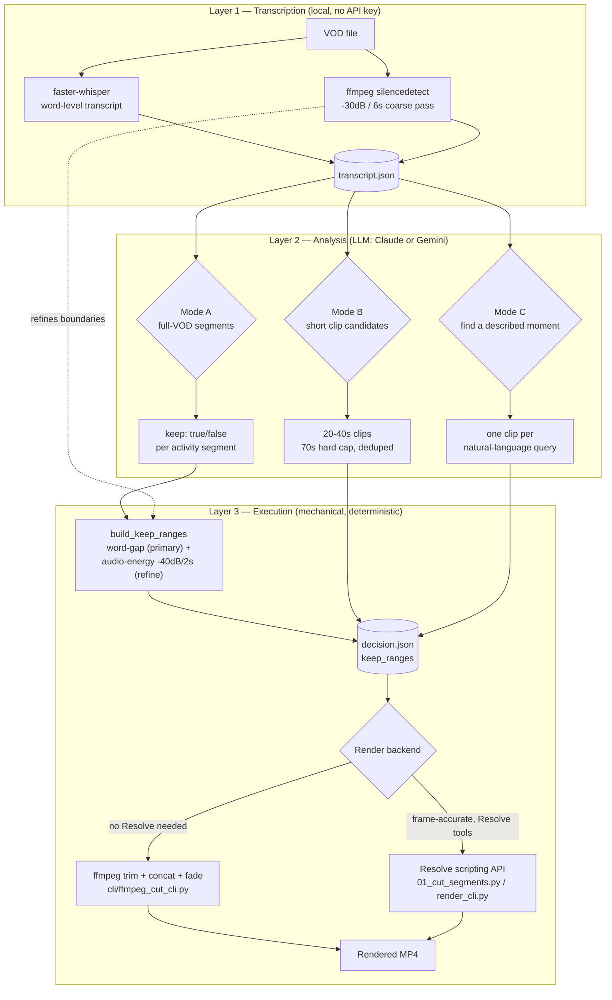

# AI Clipper

Turn a raw stream/VOD into a trimmed YouTube edit and a batch of short vertical
clips — automatically. AI Clipper transcribes the video, uses an LLM (Claude
or Gemini) to decide what's worth keeping, mechanically trims dead air with
silence + word-gap detection, and renders the result with either plain
**ffmpeg** or **DaVinci Resolve**.

> The project lives in [`ai-clipper/`](ai-clipper/). All commands below are
> run from inside that directory.

## What it does

1. **Transcribe** the VOD with word-level timestamps (local, via
   [faster-whisper](https://github.com/SYSTRAN/faster-whisper) — no API key
   needed for this step).
2. **Analyze** the transcript with an LLM to decide what's clip-worthy —
   which stretches of a long VOD belong in a single trimmed-down YouTube
   edit, and/or which short moments work as standalone vertical clips.
3. **Build keep-ranges** — a mechanical (non-LLM) pass that finds the exact
   in/out points to cut, using transcript word-gaps refined by ffmpeg's
   audio-energy silence detection.
4. **Render**, either:
   - **directly with ffmpeg** (`cli/ffmpeg_cut_cli.py`) — no other software
     required, or
   - **through DaVinci Resolve** — a script writes a decision JSON, you run a
     small script *inside* Resolve to build the timeline, then export/grade/
     reframe using Resolve's own tools.

## Architecture



**Text version of the flow:**

```
VOD
 ├─ faster-whisper  → word-level transcript (segments + words + timestamps)
 └─ ffmpeg silencedetect (-30dB / 6s) → coarse "silences" list
        │
        ▼
transcript.json  ──► LLM analysis (Claude Sonnet or Gemini) ──►
        │                                   Mode A: segments{start,end,label,keep}
        │                                   Mode B: clips{start,end,type,confidence,reason,sfx_points}
        │                                   Mode C: named_clips (one per free-text query)
        ▼
build_keep_ranges (mechanical, no LLM)
   - transcript word-gaps ≥ 2.0s are the PRIMARY cut signal
   - a fine audio-energy pass (-40dB / 2s) only nudges the cut boundary,
     it never vetoes a cut
   - padding, min-cut, min-keep guards applied
        ▼
decision.json  { source_file, keep_ranges: [{start, end}, ...] }
        │
        ├─── ffmpeg_cut_cli.py ─────────────► rendered .mp4  (no Resolve)
        │
        └─── 01_cut_segments.py (run inside  ► Resolve timeline
             Resolve's Scripts menu) / render_cli.py   → export, reframe, grade, etc.
```

## How highlights are decided

### Transcription + silence (Layer 1)

`transcription/transcribe.py` runs faster-whisper over 20-minute chunks (15s
overlap, so no sentence is lost at a chunk boundary) and produces word-level
timestamps. Alongside it, `transcription/silence.py` runs ffmpeg's
`silencedetect` filter once over the whole file:

```python
# transcription/silence.py
DEFAULT_NOISE_DB = -30
DEFAULT_MIN_DURATION = 6.0
```

These defaults were tuned against a real 2h8m stream VOD: at the spec's
original 1.5s minimum, ordinary speech pauses were getting flagged as
"silence" (568 false positives). Raising the minimum to 6.0s left only the
real dead-air stretches.

### Mechanical cut-point selection (Layer 3, `cutting/keep_ranges.py`)

This is the part that decides *exactly* where a cut starts and ends, and it's
deliberately **not** an LLM call — it's a deterministic pass over the
transcript so cut points are frame-accurate and reproducible. The key design
decision, from the module's own docstring:

> The streamer talking is what defines a highlight-worthy moment, not
> ambient loudness, so transcript word-gaps are now the PRIMARY signal and
> are accepted on their own. The audio-energy pass is downgraded to an
> optional boundary-refinement nudge — it can no longer veto a cut.

This mattered in practice: game audio/music playing under a pause kept the
track above the amplitude floor, so gating purely on audio energy (the
original spec) missed most real "streamer isn't talking" gaps. In code:

```python
# cutting/keep_ranges.py
GAP_THRESHOLD = 2.0          # min transcript word-gap to even consider a cut
BOUNDARY_TOLERANCE = 0.3     # disagreement w/ audio-energy beyond this snaps to audio-energy
TRAILING_PAD = 1.0           # silence kept after the last word
LEADING_PAD = 0.4            # silence kept before the next word
MIN_CUT = 1.5                # don't bother cutting less than this much
MIN_KEEP = 1.0                # merge/reject keep-ranges shorter than this (flicker-cut guard)
ENERGY_NOISE_DB = -40.0      # fine-grained audio-energy refinement pass
ENERGY_MIN_DURATION = 2.0
```

For every gap between two consecutive words that's ≥ `GAP_THRESHOLD`: if a
detected audio-energy silence overlaps that gap, its start/end only replaces
the word-boundary anchor when they disagree by more than
`BOUNDARY_TOLERANCE` seconds — otherwise the transcript's own timing wins.
Padding is then applied (and scaled down if the gap's too short to fit the
full pad), and any resulting keep-range under `MIN_KEEP` gets merged into its
neighbor so you never get a flicker-cut.

### LLM analysis (Layer 2, `config/prompts/`)

Three prompt modes, all forced into a structured tool call (no free-text
parsing) and validated against a pydantic schema (`analysis/schemas.py`):

| Mode | Prompt | Output | Purpose |
|---|---|---|---|
| **A** | `mode_a_segments_v1.md` | contiguous `{start, end, label, keep}` covering the whole VOD, no gaps | Long-form VOD → trimmed YouTube edit (drop dead air/AFK stretches, keep everything else) |
| **B** | `mode_b_clips_v1.md` | `{start, end, type, confidence, reason, sfx_points}` | Short-form clip candidates (funny / informational / wholesome / sad / scary) |
| **C** | `mode_c_find_clips_v1.md` | one `{name, start, end, found, reason}` per free-text query | "Find the clip where X happened" — locate a specific remembered moment |

Mode B runs over sliding 20-minute windows (2-minute overlap) so a 2+ hour
VOD never has to fit in one context window, then deduplicates near-duplicate
candidates found in the overlap:

```python
# analysis/schemas.py — hard constraints Mode B output must satisfy
CLIP_MIN_SOFT = 20.0   # target: 20-40s clips
CLIP_MAX_SOFT = 40.0
CLIP_MAX_HARD = 70.0   # schema-level rejection above this — not just a style note
```

Dedup is a plain overlap check (`analysis/client.py:_dedupe_clips`), not a
second LLM pass — two candidates merge when their windows overlap by more
than half of the shorter clip's length, and the higher-confidence one wins.
Kept mechanical on purpose: it's a "which one is bigger" decision, not one
that needs the model's understanding of content.

Mode C skips windowing entirely — it gets the *full* transcript in one call,
since locating one described moment benefits from full context and isn't an
exhaustive scan.

## Two render pipelines

Both consume the same `decision.json` shape:
`{"source_file": "/path/to/vod.mp4", "keep_ranges": [{"start": 0.0, "end": 8.0}, ...]}`
(or a raw Mode A decision — `{"segments": [...]}` — which both backends
convert by dropping `keep: false` segments).

### Option 1 — FFmpeg direct (no other software)

```bash
python -m cli.ffmpeg_cut_cli decision.json out.mp4 --fade-sec 1.0
```

Trims each `keep_range` with ffmpeg's `trim`/`atrim` filters, concatenates
them back to back, fades in/out, and encodes with `libx264`/`aac`. Fully
self-contained — good default if you don't have DaVinci Resolve installed.

### Option 2 — DaVinci Resolve (frame-accurate, access to Resolve's toolset)

Two ways to drive Resolve:

1. **Manual, via the Scripts menu** (`execution/resolve_scripts/`) — copy a
   `decision.json` path into the constant at the top of the script, then run
   it from Resolve's `Workspace → Scripts → Edit` menu (these scripts only
   run inside Resolve's own embedded Python interpreter, not from a
   terminal):
   - `01_cut_segments.py` — cut a VOD down to its keep_ranges on a new timeline.
   - `03_reframe.py` — cut one clip and reframe it 16:9 → 1:1 with Resolve's
     `SmartReframe()`.
   - `04_named_clips.py` — cut every clip from a Mode C named-clips JSON onto
     its own named timeline.
2. **Scripted, via `render_cli.py`** — drives Resolve Studio's scripting API
   directly from the terminal (Resolve must be open with a project loaded,
   and *"External scripting using"* enabled in Preferences → General):
   ```bash
   python -m cli.render_cli vod.mp4 decision.json out.mp4 --fade-sec 1.0
   ```

Resolve's scripting API has no fade primitive, so fades there are applied by
rendering the cut timeline and running one ffmpeg pass over the export — the
LLM never touches pixels either way, and Resolve still does the actual
frame-accurate cutting.

## Setup

**Prerequisites**
- Python 3.11+
- [ffmpeg](https://ffmpeg.org/) / ffprobe on your `PATH` (`brew install ffmpeg` / `apt install ffmpeg`)
- One API key: [Anthropic](https://console.anthropic.com/) (`ANTHROPIC_API_KEY`) or [Gemini](https://aistudio.google.com/apikey) (`GEMINI_API_KEY`) — pay-as-you-go keys, not a Claude.ai/Claude Code subscription
- *(optional, only for the Resolve pipeline)* DaVinci Resolve **Studio** (the scripting API needs Studio, not the free version)

**Install**

```bash
git clone <this-repo>
cd ai-clipper
python3 -m venv .venv && source .venv/bin/activate
pip install -r requirements.txt

cp .env.example .env
# edit .env and paste in ANTHROPIC_API_KEY or GEMINI_API_KEY
```

## Usage

```bash
# 1. Transcribe (local — no API key needed for this step)
python -m cli.transcribe_cli vod.mp4 --out transcript.json

# 2a. Mode A — decide what to keep for a trimmed full VOD → YouTube edit
python -m cli.analyze_cli transcript.json a --out mode_a.json

# 2b. Mode B — find short vertical-clip candidates
python -m cli.analyze_cli transcript.json b --out mode_b.json

# 2c. Mode C — find a specific moment you remember
python -m cli.find_clips_cli transcript.json named_clips.json \
    --query "the clip where my teammate said the guy was 1hp"

# 3. Build precise cut points for one window (mechanical, no LLM)
python -m cli.build_keep_ranges_cli vod.mp4 transcript.json 0 3600 decision.json

# 4. Render — pick one:
python -m cli.ffmpeg_cut_cli decision.json out.mp4          # no Resolve needed
python -m cli.render_cli vod.mp4 decision.json out.mp4      # via Resolve scripting API
```

`analyze_cli`, `find_clips_cli`, and `build_keep_ranges_cli` all cache their
results under `eval/cache/`, keyed off the VOD's path/size/mtime — re-running
the same step is free until you pass `--force`.

## Repo layout

```
ai-clipper/
├── transcription/      Layer 1 — faster-whisper transcription + ffmpeg silence detection
├── analysis/            Layer 2 — LLM backends (Claude/Gemini), prompts→schema validation, caching
├── config/prompts/       Mode A/B/C prompt templates
├── cutting/              Layer 3 — mechanical keep-range builder (word-gap + audio-energy)
├── execution/            Render backends: ffmpeg-only, DaVinci Resolve (API + manual scripts)
├── cli/                  Command-line entrypoints for every step above
├── common/               Shared env loading + progress reporting
└── eval/                 Scoring harness + smoke tests + local cache/decisions (gitignored)
```

## Notes

- Every stage is deterministic and cacheable except the two LLM calls
  (Mode A/B/C); nothing here retries silently on a schema-invalid LLM
  response more than twice before raising (`analysis/client.py`).
- The mechanical keep-range builder warns (doesn't fail) if a window would
  have more than 40% of its content cut — a signal to sanity-check the
  thresholds before trusting the output on unusual audio.
- `execution/resolve_scripts/*.py` must be run through Resolve's own
  `Workspace → Scripts` menu, not `python script.py` from a terminal —
  Resolve injects the `bmd` global those scripts rely on.
